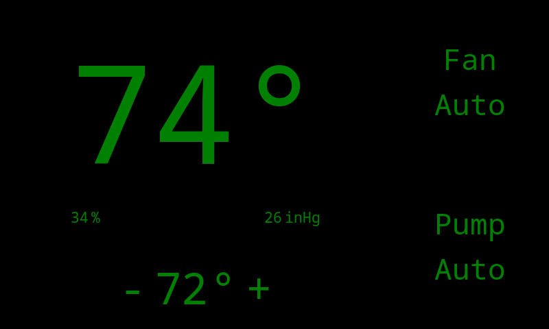
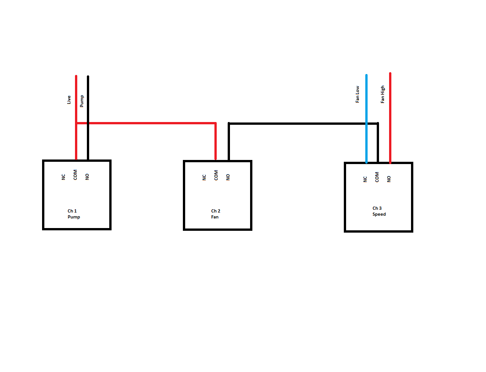

# Raspberry Pi Thermostat  
### Swamp Cooler Thermostat using Raspberry Pi. Has Full UI, scheduling, and datalogging  
# BOM
- RPi
- [RPi 7in touchscreen](https://www.raspberrypi.com/products/raspberry-pi-touch-display/)
- [Smarti Pi Touch](https://smarticase.com/collections/all-products/products/smartipi-touch-2)
- [Waveshare Relay HAT](https://www.waveshare.com/rpi-relay-board.htm)
- [BME280](https://www.adafruit.com/product/2652)
# Requirments
- [Adafruit Blinka](https://learn.adafruit.com/circuitpython-on-raspberrypi-linux)
- [Adafruit BME280](https://learn.adafruit.com/adafruit-bme280-humidity-barometric-pressure-temperature-sensor-breakout/python-circuitpython-test)
# Installation
- Move folder to desktop (or anywhere you want): `cp ./PiThermostat /Home/Pi/Desktop`
- Make an autostart folder: `mkdir /home/pi/.config/autostart`
- Move .desktop file to autostart folder: `cp ./thermostat.desktop /home/pi/.config/autostart`
	- Note: Modify `Exec` in `./thermostat.desktop` if you placed main folder somewhere else
- Schedule / logging can be modified in `./PiThermostat/config.ini`
# Screenshot

# Circuit
